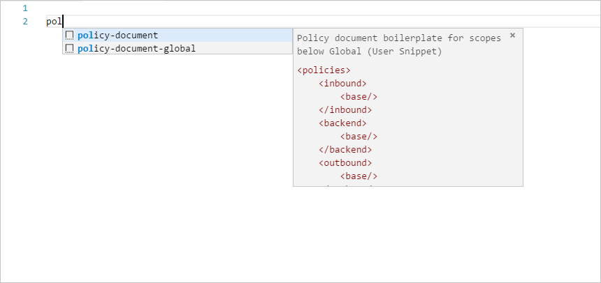
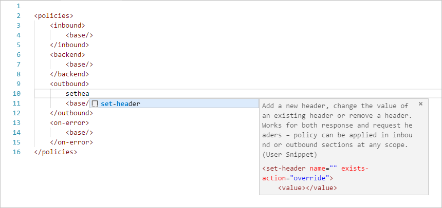
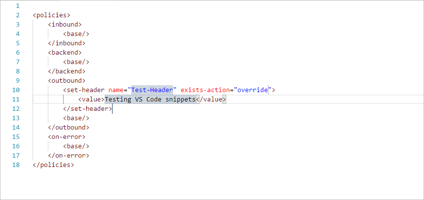

# Azure API Management Policy Snippets

# Policy Toolkit

[Azure API Management policy toolkit](https://github.com/Azure/azure-api-management-policy-toolkit) is a set of libraries and tools for authoring policy documents for Azure API Management. The toolkit was designed to help create and test policy documents with complex expressions.

# Examples

The `examples/` folder contains policy examples contributed by the product team and the user community. The samples are meant to be re-used verbatim, provide inspiration or serve as learning aids. Some of them are parameterized using [Named Values](https://docs.microsoft.com/en-us/azure/api-management/api-management-howto-properties) (formerly known as Properties), which look like this: `{{some-value}}`. When using parametrized samples, you will have to either define relevant Named Values or replace them with values in place.

# Policy expressions cheat-sheet

The `policy-expressions` folder contains a [cheat-sheet](policy-expressions/README.md) with common policy expressions that are often used when authoring Azure API Management policies.

# Visual Studio Code snippets

The `vscode-snippets/` folder contains user snippets for Visual Studio Code. User snippets are helpful for streamlining workflow and simplifying document editing with autocomplete and easy navigation. Please, refer to the [Visual Studio Code documentation](https://code.visualstudio.com/docs/editor/userdefinedsnippets) on how to use them.

# Helpful Links

- [Policies Reference](https://docs.microsoft.com/en-us/azure/api-management/api-management-policies)
- [Policy Expressions](https://docs.microsoft.com/en-us/azure/api-management/api-management-policy-expressions)
- [Handling Errors in Policies](https://docs.microsoft.com/en-us/azure/api-management/api-management-error-handling-policies)
- [Policy Toolkit](https://github.com/Azure/azure-api-management-policy-toolkit)
- [APIM Samples](https://aka.ms/apim/samples)

To learn about Azure API Management go [here](https://azure.microsoft.com/en-us/services/api-management/).

# Contributing

This project has adopted the [Microsoft Open Source Code of Conduct](https://opensource.microsoft.com/codeofconduct/). For more information see the [Code of Conduct FAQ](https://opensource.microsoft.com/codeofconduct/faq/) or contact [opencode@microsoft.com](mailto:opencode@microsoft.com) with any additional questions or comments.
